# Xenophon Portfolio Evidence

This folder is the portfolio evidence pack for Xenophon: architecture flow, Compare-mode visual, fixed benchmark questions, and a repeatable benchmark runner.

## What Is Ready

- Flow diagram: [flow.mmd](flow.mmd)
- Compare-mode preview: [compare-mode-preview.svg](compare-mode-preview.svg)
- Live Compare-mode screenshot: [screenshots/compare-mode-dropout.png](screenshots/compare-mode-dropout.png)
- Fixed evaluation questions: [evaluation-questions.json](evaluation-questions.json)
- Live benchmark runner: [../../scripts/run_portfolio_benchmark.mjs](../../scripts/run_portfolio_benchmark.mjs)

## What Needs Live Secrets

To generate real benchmark results, provide:

- `OPENROUTER_API_KEY` - required for Standard and RAG/Agent answer generation.
- `SUPABASE_URL` - optional; defaults to the current Xenophon project URL from the app config.
- `SUPABASE_ANON_KEY` - optional; defaults to the current publishable Supabase key from the app config.
- `XENOPHON_MODEL` - optional; defaults to `google/gemini-2.5-flash`.

The fixed benchmark questions include `expected_sources` so each run can check whether retrieved chunks come from the expected document as well as whether the answer cites returned source indexes correctly.

## Flow Diagram

```mermaid
flowchart LR
  User["User question"] --> UI["Static browser UI"]
  UI --> Mode{"Response mode"}

  Mode -->|"Standard"| OR1["OpenRouter chat completion"]
  OR1 --> StdAnswer["Direct answer"]

  Mode -->|"RAG"| RagFn["Supabase Edge Function: rag-chat"]
  Mode -->|"Agent"| RagFn

  RagFn --> Guard["Input guards\nrate limit, model allowlist,\nquery/message limits"]
  Guard --> Planner{"Agent mode?"}
  Planner -->|"yes"| Plan["Planner\nintent + retrieval queries"]
  Planner -->|"no"| RawQuery["Latest user message"]

  Plan --> Retrieval["Embedding + pgvector search"]
  RawQuery --> Retrieval
  Retrieval --> Sources["Normalized sources\ncitations + similarity"]
  Sources --> Answer["OpenRouter answer\nwith retrieved evidence"]
  Answer --> CitationCheck{"Valid citations?"}
  CitationCheck -->|"no"| AnswerRetry["Answer retry\nsame evidence, stricter citations"]
  CitationCheck -->|"yes"| Verify{"Agent mode?"}
  AnswerRetry --> Verify
  Verify -->|"yes"| Grounding["Grounding verification"]
  Grounding --> Retry{"Weak evidence?"}
  Retry -->|"yes"| Retrieval
  Retry -->|"no"| RagAnswer["Grounded answer + trace"]
  Verify -->|"no"| RagAnswer

  StdAnswer --> Compare["Compare view"]
  RagAnswer --> Compare
  Compare --> Telemetry["Portfolio metrics\nretrieval, citations,\ncost, latency"]
```



## Run Benchmark

```bash
OPENROUTER_API_KEY=sk-or-v1-... npm run benchmark:portfolio
```

Optional overrides:

```bash
SUPABASE_URL=https://project-ref.supabase.co \
SUPABASE_ANON_KEY=sb_publishable_... \
XENOPHON_MODEL=google/gemini-2.5-flash \
XENOPHON_BENCHMARK_LIMIT=15 \
npm run benchmark:portfolio
```

The runner writes:

- `docs/portfolio/results/latest.json`
- `docs/portfolio/results/latest.csv`
- `docs/portfolio/results/latest.md`

## Metrics

- `retrieved_count`: number of chunks returned by RAG.
- `max_similarity`: strongest returned source similarity.
- `citation_validity`: share of bracket citations that point to returned sources.
- `citation_pass`: true when citations are present and structurally valid for questions requiring citations.
- `expected_source_coverage`: share of expected source title/path mappings found in the returned sources.
- `expected_source_pass`: true when all expected sources are represented in the returned sources.
- `expected_term_coverage`: share of expected answer terms found in the RAG answer.
- `standard_latency_ms` and `rag_latency_ms`: end-to-end request latency per path.
- `standard_cost_usd` and `rag_cost_usd`: estimated cost using the frontend pricing table.
